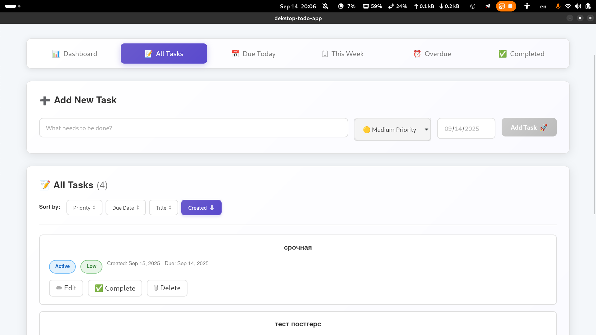

# To-Do List App (Wails + Go + JS)

## 🚀 Функционал

### 1. Интерфейс пользователя (25/25)
- ✅ Текстовое поле для ввода новой задачи  
- ✅ Кнопка для добавления задачи  
- ✅ Отображение списка всех задач  
- ✅ Стилизация с помощью CSS  
- ✅ Обозначение выполненных и невыполненных задач (цвета/иконки)  
- ✅ Адаптивная вёрстка  
- ✅ Переключение светлой/тёмной темы  

### 2. Добавление задач (20/20)
- ✅ Добавление новой задачи в список  
- ✅ Валидация (защита от пустого ввода)  
- ✅ Добавление даты и времени выполнения  
- ✅ Установка приоритета (низкий / средний / высокий)  

### 3. Удаление задач (15/15)
- ✅ Удаление задач из списка  
- ✅ Подтверждение удаления (модальное окно)  

### 4. Управление выполнением задач (30/30)
- ✅ Отметка задачи как выполненной  
- ✅ Зачеркивание текста выполненных задач  
- ✅ Перемещение выполненных задач в отдельный раздел  
- ✅ Возможность вернуть задачу обратно в активные  

### 5. Сохранение состояния (50/50)
- ✅ Сохранение состояния задач при закрытии приложения  
- ✅ Загрузка задач при запуске  
- ✅ Хранение задач в PostgreSQL  
- ✅ Архитектура repo → service → usecase  

### 6. Фильтрация и сортировка (20/20)
- ✅ Фильтрация: все / активные / выполненные  
- ✅ Сортировка по дате добавления  
- ✅ Сортировка по приоритету  
- ✅ Фильтрация по дате (сегодня / на неделю / просроченные)  

---

## 📸 Скриншоты


Больше фото в photos/

## 🎬 Демонстрация

[](https://youtu.be/Gtjbo0Ja8dI)

## 🔧 Запуск проекта

### Требования
- Go >= 1.22  
- Node.js >= 18  
- PostgreSQL >= 14  
- Wails v2
- Docker, Docker-compose
- Make (желательно)

## 

```
git clone https://github.com/w0ikid/desktop-todo-app
cd desktop-todo-app
```

Настройте .env (есть .env.example)

```
make dev-up

wails dev
```

make если нету:

```
docker-compose up -d postgres

docker-compose up migrate
```